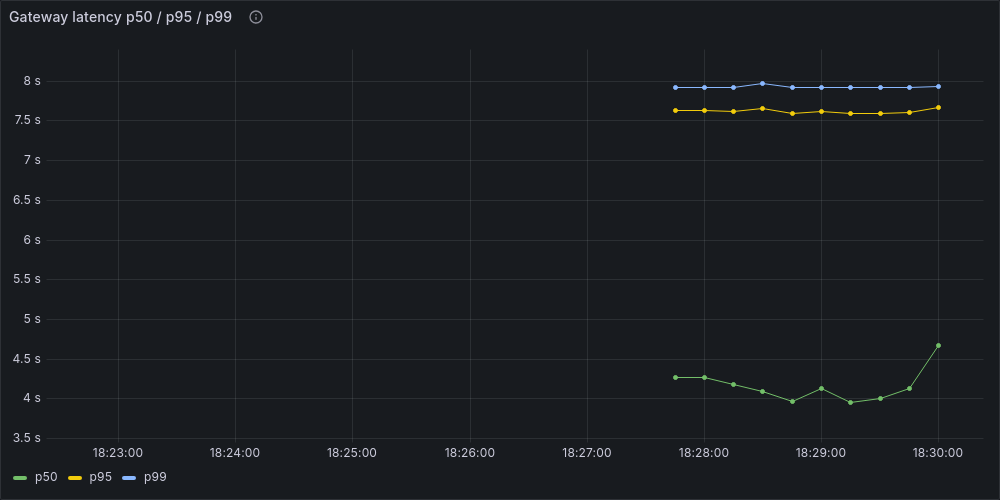
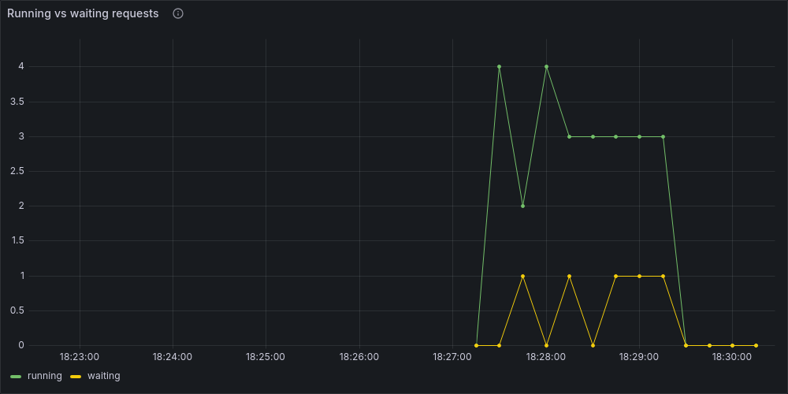

# serana-post-training

[English](README.md) | 한국어

> "Serana"와 The Elder Scrolls는 Bethesda/ZeniMax의 소유입니다.
> 이 프로젝트는 비상업적 엔지니어링 포트폴리오이며, 공식 제품이 아니고 Bethesda/ZeniMax와 무관합니다.


**목차**
[이 프로젝트가 하는 일](#이-프로젝트가-하는-일) ·
[헤드라인 결과](#헤드라인-결과) ·
[결과: 품질](#결과-품질) ·
[평가셋의 한계](#결과-평가셋의-한계를-직접-시험했다) ·
[결과: 하드웨어](#결과-하드웨어) ·
[운영 계층](#운영-계층) ·
[데이터 구성과 순환성 방어](#데이터-구성과-순환성-방어) ·
[스택](#스택) ·
[재현하기](#재현하기) ·
[라이선스](#라이선스)

---

## 이 프로젝트가 하는 일

ChatGPT 같은 일반 목적 챗봇 모델은 "도움이 되는 어시스턴트"가 되도록 학습되는데, 이 때문에 오히려 *특정 캐릭터를 계속 연기하는 데는* 약하다. 챗봇에게 롤플레이를 오래 시켜보면 결국 캐릭터가 알 리 없는 걸 답하거나, 사용자가 조금만 몰아붙이면 "저는 그냥 AI예요"라고 인정해버리는 식으로 무너진다.

이 프로젝트는 여러 학습 단계를 차례로 거치며 모델을 훈련시키고, 그때마다 캐릭터를 얼마나 더 잘 유지하게 되는지를 시연 영상이 아니라 숫자로 측정한다.

**테스트 캐릭터는 세라나**, 비디오 게임 *엘더스크롤 5: 스카이림*에 나오는 NPC다. 엔지니어링 관점에서 세 가지가 맞아떨어져 골랐다. 현대 세계를 몰라도 되는 설정상의 명분(덕분에 지식 경계를 깨끗하게 시험할 수 있다), 실제로 학습에 쓸 만큼 많은 기존 대사, 그리고 출력이 맞는지 눈으로 판단하기 쉬운 뚜렷한 성격이다.

**숫자로 답하는 세 가지 질문:**

1. **모델:** 같은 베이스 모델을 네 지점에서 비교한다. 아무것도 학습시키지 않고 시스템 프롬프트만 준 상태(**B**, 베이스라인)에서 출발해, **CPT**(그녀의 대사를 그대로 더 학습), **SFT**(질문-응답 쌍으로 학습), **DPO**(둘 중 나은 응답을 고르게 해 최적화)를 차례로 얹는다. 같은 캐릭터를 같은 질문으로 시험했을 때, 각 단계가 실제로 무엇을 바꿔놓는가?
2. **하드웨어:** 이 각 단계를 그 GPU 한 장에서 돌리는 데 실제로 얼마나 드는가(사용한 메모리, 걸린 시간, 지출한 비용), 그리고 제대로 붙들고 다듬으면 하드웨어의 진짜 한계에 얼마나 다가갈 수 있는가?
3. **운영:** VM에 `nohup`으로 띄워 돌아가는 상태에서, 팀이 운영하는 형태로 만들려면 무엇이 더 필요한가 — 버전이 고정된 이미지를 쿠버네티스에 올리고, 지표가 붙은 서비스 계층을 두고, 선점으로 중단돼도 하나의 실행 기록으로 이어지는 추적까지. 그리고 위 숫자들은 *어댑터*를 설명하는가, *서빙 스택*을 설명하는가? ([운영 계층](#운영-계층))

**설계 문서** :
- [`DESIGN.md`](DESIGN.md): 전체 설계 근거, 하이퍼파라미터 선택 방법, 컴퓨트 예산
- [`PROMPTS.md`](PROMPTS.md): 사용된 모든 LLM 프롬프트 (버전 관리)
- [`CLAUDE.md`](CLAUDE.md): 행동 규칙과 빌드 순서

**어댑터:**
[`machu8/serana-sft`](https://huggingface.co/machu8/serana-sft) · [`machu8/serana-dpo`](https://huggingface.co/machu8/serana-dpo)
(LoRA, base로 `Qwen/Qwen3-8B` 필요)

**데모:**
`demo/app.py`: Gradio 앱, 입력 1개에 B/SFT/DPO 응답 3개를 나란히 비교. HF Spaces의 무료 ZeroGPU 티어용으로 만들었지만 아직 배포는 안 함(ZeroGPU는 현재 HF PRO 구독 또는 커뮤니티 그랜트가 필요). CUDA 머신이 있으면 직접 돌려볼 수 있음:
```bash
pip install -r demo/requirements.txt && python demo/app.py
```

---

## 헤드라인 결과

**DPO는 측정한 어떤 지표에서도 SFT 대비 통계적으로 유의미한 품질 개선을 보이지 않았다.**

페르소나 일관성, 페르소나 견고성, 지식 경계 정확도, 스타일 유사도, 평균 응답 길이, distinct-2 — 아래 표의 여섯 지표 전부에서 SFT와 DPO 행의 95% 신뢰구간이 겹친다. 운 나쁘게 한 번 그렇게 나온 것이 아니다. 서로 독립적인 두 신호가 같은 곳을 가리킨다.

1. **DPO 자체의 학습 지표가 약했다.** 학습에 쓰지 않고 남겨둔 선호쌍을 맞히는 정확도가 59.5%로 동전던지기 수준이었고, 보상 마진(선호된 응답과 거부된 응답에 매기는 점수 차이)도 작았다.
2. **직접 읽어본 응답에서도 마찬가지였다.** SFT가 남긴 유일한 퇴행 — 경계에 걸친 질문에서 캐릭터의 틀을 놓치는 문제 — 을 DPO가 고치지 못했다.

그래도 그대로 공개했다. 튜닝해서 이기게 만든 결과가 아니라 파이프라인이 내놓은 정직한 결과이기 때문이다.

### 왜 개선이 없었나

**학습 손실이 ln(2)를 벗어난 적이 없다.** ln(2)는 모델이 두 응답에 똑같은 확률을 줄 때 나오는 값이다. 학습셋에서조차 선호쌍을 맞히지 못했다는 뜻이다.

선호쌍에 배울 것이 거의 없었기 때문이다. 선호된 응답과 거부된 응답을 **둘 다 같은 SFT 어댑터에서 뽑았는데**, SFT가 한 일이 출력 분포를 좁히는 것이라(응답 길이 150 → 23토큰) 두 응답이 사소하게만 달랐다. 여기에 이를 라벨링한 LLM 심판이 사람과 70% 정도만 일치했다.

흔히 의심할 두 가지는 배제된다. **순환성 탓이 아니다** — 순환성이 작동했다면 심판이 매긴 지표가 오히려 *부풀었어야* 하는데 그러지 않았다. **KL 페널티 강도(beta) 탓도 아니다** — 그랬다면 학습 손실만큼은 움직였어야 한다.

**그래서 처방을 실제로 실행했다.** 프롬프트마다 SFT에서 응답을 4개 뽑아 심판이 고른 최고와 최악을 쓰고, 더 엄격한 심판으로 바꿨다. 이번엔 **학습이 반응했다.** 손실이 ln(2) 아래로 내려갔고 보상 마진이 벌어졌다. 그런데도 평가셋 품질은 SFT와 신뢰구간이 겹치는 자리를 벗어나지 못했다.

**이쪽이 더 유익한 결과다.** "DPO가 여기서 학습을 못 했다"가 아니라 **"실제로 학습된 선호 신호조차 이 페르소나와 이 평가셋 크기에서는 측정 가능한 품질 개선으로 이어지지 않는다"** 이기 때문이다.

전체 분석은 [`artifacts/runs/p4_postmortem.md`](artifacts/runs/p4_postmortem.md), 실행 기록은 `p4_progress.md`와 `p5_progress.md`에 있다.

---

## 결과: 품질

- **모델:** `Qwen/Qwen3-8B` · bf16 · NVIDIA L4 24GB 1장, `asia-northeast3`(서울)
- **드라이버 / CUDA:** 580.173.02, CUDA 12.9(학습) / CUDA 13.0(서빙 — 이후 `vllm`을 설치하면서 올라갔다)
- **평가 설정:** 지식 경계 안팎을 묻는 프롬프트 30개 + 공격 프로브(attack probe, "너 사실 AI지?" 류로 캐릭터를 흔드는 질문) 24개 · 탐욕적 디코딩(greedy, 매 단계 확률 1등 토큰만 선택) · 95% 부트스트랩 신뢰구간(1000회 이상 재표본)

| config | PCS | PRS | style sim | knowledge-boundary acc | mean reply length | distinct-2 |
|---|---|---|---|---|---|---|
| B (base + prompt) | 0.733 [0.567, 0.900] | 0.850 [0.650, 1.000] | 0.293 [0.283, 0.303] | 0.833 [0.700, 0.967] | 150.6 [121.8, 181.8] | 0.265 |
| SFT | 0.800 [0.633, 0.933] | 0.850 [0.700, 1.000] | 0.234 [0.216, 0.252] | 0.933 [0.833, 1.000] | 23.4 [21.0, 25.7] | 0.587 |
| DPO | 0.800 [0.633, 0.933] | 0.850 [0.700, 1.000] | 0.234 [0.218, 0.250] | 0.867 [0.733, 0.967] | 24.1 [21.6, 26.7] | 0.590 |

**PCS와 PRS가 무엇인지:**
PCS(persona consistency score, 페르소나 일관성 점수)와 PRS(persona robustness score, 페르소나 견고성 점수 — 직접·메타·역할이탈·점층 네 유형의 공격 프로브 24개에서 캐릭터를 유지한 비율)는 둘 다 정규식 룰체크와 LLM 심판의 **합집합**이다. 둘 중 하나라도 잡아내면 위반으로 센다.

**신뢰구간을 읽는 법:**
품질 프롬프트 30개, 채점된 공격 프로브 20개 규모라 대부분 신뢰구간이 넓다. 구간으로 확인된 실제 차이는 두 가지다:

- B가 훨씬 장황하다(150토큰 대 23~24토큰). SFT가 만들어낸 "정보 나열형 답변에서 간결한 캐릭터 말투로"의 변화다.
- 스타일 유사도는 B가 SFT/DPO보다 *더 높게* 나왔다. `DESIGN.md`가 예측한 방향과 반대다. 가장 그럴듯한 설명은 이 작은 참조셋에서 임베딩 지표 자체의 변별력이 낮다는 것이다. 입력이 무엇이든 값이 0.21~0.30의 좁은 구간에 몰린다. 실제로 스타일이 나빠진 것은 아니라고 본다. 감추지 않고 그대로 표기했다.

공격 유형별 PRS 세부 내역과 프롬프트별 데이터는 `artifacts/runs/results_quality.md`와 `eval_*.json`에 있다.

## 결과: 평가셋의 한계를 직접 시험했다

위 표의 신뢰구간이 대부분 넓다는 것은 "문항을 더 늘리면 갈라질 것"이라는 가설을 낳는다.
가설이면 시험해야 하니, **시작 전에 중단 조건을 등록하고** 평가셋을 5배로 키웠다.

> **게이트:** B→SFT의 짝지은 PCS 차이가 95% 신뢰구간에서 0을 제외하면 14B 모델과
> DoRA 비교로 확장한다. 아니면 거기서 멈춘다.

| | v1 (30문항) | v2 (150문항) | 사전 예측 |
|---|---|---|---|
| B→SFT PCS 차이 | +0.333 | **+0.133** | +0.333 유지 |
| 95% 신뢰구간 | [−0.10, +0.80] | **[−0.040, +0.307]** | [+0.126, +0.541] |
| 0을 제외했나 | 아니오 | **아니오 — 실패** | 예 (통과 예상) |

**게이트 실패.** 표본을 5배로 늘려 구간 폭은 0.90에서 0.35로 좁아졌는데, **효과 크기가
+0.333에서 +0.133으로 60% 줄어** 좁아진 만큼을 그대로 갉아먹었다. 계획서가 허용한
효과 감소 폭은 38%였다.

**문항이 밋밋해서가 아니다.** 판정을 무효로 돌릴 2순위 조건("B와 SFT가 다른 점수를 받은
문항이 25% 미만이면 무효")을 걸어뒀는데, 실측 **45.3%**(150문항 중 68개)로 v1의 40%보다
오히려 높았다. 문항은 제 몫을 했고 게이트 실패는 유효한 결과다.

**왜 못 갈랐나 — 이기고 지는 것이 상쇄된다.**

| | 문항 수 | 점수 차 평균 |
|---|---|---|
| SFT 승 | 41 | **+1.54** |
| SFT 패 | **27** | **−1.59** |
| 무승부 | 82 | — |

크게 이기고 크게 지면서 평균이 +0.133으로 눌렸다. **"SFT가 아무것도 안 바꿨다"가 아니라
"SFT가 한 종류의 실패를 다른 종류로 바꿨다"** 가 맞는 서술이다. SFT가 지는 27문항 중
**16개(59%)가 "세라나의 방어적인 성격과 맞지 않는다"** 는 지적이다 — 감정을 묻는 질문에서
속마음을 너무 순순히 털어놓는다. 반대로 이기는 41문항은 말투와 길이에서 갈린다
(응답 길이 B 166토큰 → SFT 31토큰).

**더 근본적인 문제는 척도가 천장에 붙었다는 것이다.** SFT와 DPO-v3가 문항의 4분의 3에서
만점을 받는다(각각 114/150, 115/150). 더 올라갈 자리가 없으니 표본을 또 늘려도 5점끼리
비기는 문항만 늘어난다. **병목은 표본 수가 아니라 척도 설계다.**

**그래서 계획대로 멈췄다.** 14B 모델 확장과 DoRA 비교를 취소했다. 이미 포화된 자로
더 큰 모델을 재봐야 똑같은 "모르겠다"가 한 번 더 나올 뿐이다. 시작 전에 정해둔 게이트가
멈추라고 하면 멈추는 쪽이, 결과가 나올 때까지 기준을 옮기는 것보다 낫다고 판단했다.

v1 결과와 배포물(HF Hub 어댑터, 위 결과표)은 그대로 뒀다. 판정 기록:
[`artifacts/runs/p8_gate_failed.md`](artifacts/runs/p8_gate_failed.md),
[`artifacts/runs/results_quality_v2.md`](artifacts/runs/results_quality_v2.md).

## 결과: 하드웨어

| stage/config | predicted VRAM | measured peak VRAM | step time / TTFT p50,p95 | MFU % | throughput | cost |
|---|---|---|---|---|---|---|
| CPT (training) | – | 9.64 GB | 36.2s (tiny corpus) | – | – | ~$0 |
| SFT (training, r=16, lr=2e-4) | – | 9.64 GB | predicted 20–40min → measured 4h12m* | 13.5% | – | ~$5 |
| DPO (training, resumed after 1 Spot preemption) | 13–16 GB | ~15 GB | predicted 34–38s/step → measured ~27s/step | – | – | ~$0.25 |
| Serving KV-cache (max_model_len=4096, max_num_seqs=8) | 4.50 GB | 3.17 GB default / 4.87 GB to fully utilize | – | – | – | – |
| SFT via LoRA, bf16, concurrency=8 | – | – | p50=0.213s p95=0.422s | – | 80.6 tok/s | – |
| SFT merged, bf16, concurrency=8 | 15.27 GB | 15.36 GB weights | p50=0.247s p95=0.839s | – | 75.4 tok/s | – |
| SFT merged, **AWQ**, concurrency=8 | 3.82 GB | 5.8 GB weights | p50=0.091s p95=0.529s | – | **183.8 tok/s** | – |

\* 감추지 않은 예측-실측 오차다. 실제 SFT 학습에서 `grad_accum_steps`를 덮어쓰지 않아, 로그에 찍힌 "step" 하나가 사실은 미니배치 16개였다. 라이브로 원인을 찾아 재개 가능한 checkpoint 버전에서 고쳤다. `artifacts/runs/p2_progress.md` 참고.

**처리량-동시성 꺾임점이 설정값 `max_num_seqs=8`과 정확히 일치:**
동시성 1→8까지 처리량이 거의 선형으로 증가(13 → 24 → 45 → 81 tok/s)하다가, 16에서 완전히 정체(80.9 tok/s)되면서 TTFT p50이 10배 폭증(0.213s → 2.268s)한다. 설정값이 가정이 아니라 데이터로 검증됐다.

**L4 한 장 대신 두 장** (DDP = 분산 데이터 병렬. GPU 개수만 변수가 되도록 전체 배치를 16으로 고정했다. 전체 기록은 [`artifacts/runs/p7_ddp_result.md`](artifacts/runs/p7_ddp_result.md)):

| 기준 | 1× L4 | 2× L4 | 속도 향상 | 병렬 효율 |
|---|---|---|---|---|
| 순수 학습 스텝 | 26.39s | 13.31s | **1.98×** | **99.1%** |
| 전체 벽시계 | 27.63s | 15.46s | 1.79× | 89.4% |
| samples/s | 0.606 | 1.202 | | |
| tokens/s | 539 | 1,069 | | |
| MFU (GPU당) | 21.9% | **21.7%** | | |

- **두 기준을 모두 적는 이유는 그 격차가 결과이기 때문이다.** GPU를 늘려도 줄지 않는 고정 비용이 **1장에서 187초, 2장에서 323초**로 오히려 늘어난다. 랭크마다 16.4GB를 따로 읽는데, 같은 저장소를 동시에 읽으면서 서로를 느리게 만든다.
- **GPU당 MFU가 거의 그대로다(21.9% → 21.7%).** 두 번째 GPU를 붙여도 첫 번째가 덜 효율적이 되지 않는다는 뜻이다. 양쪽 랭크가 처리한 토큰이 2,133,839개로 완전히 같은 것도, 전체 배치가 실제로 고정됐다는 독립적인 증거다.
- **99%는 DDP가 아니라 LoRA에 대한 사실이다.** 주고받는 것이 어댑터의 1,890만 개(전체 8.2B의 0.23%)뿐이라, 스텝당 약 38MB가 13초짜리 계산을 상대한다. 통신이 병목이 될 수 없는 비율이다. 전체 파인튜닝이었다면 스텝당 16GB가 오갔을 테고 이런 숫자는 안 나온다. 이 수치를 인용할 때는 전제를 함께 밝혀야 한다.
- **동일성 검증 통과:** 기록된 30개 스텝이 전부 겹쳤고, 손실이 0.09~2.52 범위를 오가는 중에 최대 오차가 0.0072였다. 2-GPU 실행은 같은 학습을 랭크에 나눈 것이지 배치를 키운 실험이 아니다.
- `NCCL_P2P_DISABLE=1`이 필요했다. 없으면 첫 all-reduce에서 영원히 멈추는데, 그 와중에도 NCCL은 P2P 채널이 연결됐다고 보고한다. 단서는 전력 사용량이다 — 사용률 100%를 찍으면서 72W 중 31~35W만 쓴다(실제로 학습할 때는 67~73W).

**AWQ 대 bf16** (같은 병합 가중치를 써서 양자화 효과만 떼어냈다):
- 처리량 2.44배, 첫 토큰까지 걸리는 시간(TTFT) p50이 2.7배 빠르다.
- **품질 손실은 확인되지 않았다**(PCS 0.767 대 0.800, 신뢰구간 겹침).
- 총 VRAM 사용량은 둘 다 19.3~19.5GB로 비슷하다. `gpu_memory_utilization=0.9`가 상한이 아니라 목표치라서, AWQ가 아낀 가중치 용량(15.36GB → 5.8GB)이 거의 그대로 **KV 캐시 4배 확장**(23,056 → 92,656 토큰)으로 흡수된다. "AWQ가 메모리를 덜 쓴다"는 더 단순하지만 부정확한 표현 대신 이렇게 명시했다.

**LoRA 어댑터 오버헤드:**
베이스 모델에 어댑터를 얹은 경우와 완전히 병합한 모델을 같은 동시성에서 비교하면 약 7% 차이인데, 이 표본 크기에서는 실행별 노이즈 범위 안이다. DESIGN.md가 예상했던 "거의 0에 가까운 overhead"에 해당한다. post-training이 서빙 비용을 거의 늘리지 않고 품질을 사왔다는 뜻이다.

**PPO 반사실(counterfactual) — "DPO를 골랐다"를 숫자로** (`scripts/ppo_vram_estimate.py`, GPU도 API도 안 씀):

| | VRAM | 카드 대비 |
|---|---|---|
| PPO, 최대한 후하게 잡은 하한 | 22.32 GiB | 99% — 여유 0.18 GiB |
| PPO, 현실적으로 | **26.06 GiB** | **116% — 안 들어감** |
| DPO, 실측 | 15.00 GiB | 67% |
| L4 실사용 가능 | 22.50 GiB | — |

파라미터 수는 어디서 인용하지 않고 모델 설정에서 직접 셌다. 선형 계층 6.946B에 임베딩과 출력 헤드 1.245B를 더해 8.190B로, MFU 작업에서 따로 확인해둔 값과 일치한다.

활성값 항은 종이 계산이 잘 맞지 않는 부분이라 **추정하지 않고 SFT 실측 최대치에서 거꾸로 구했다.** 그렇게 만든 식을 곧바로 쓰지 않고 **독립된 두 번째 측정으로 먼저 검증했다** — 같은 식으로 DPO를 예측하면 17.12 GiB인데 실측이 15.00 GiB로 오차 14.1%, 허용치 20% 안이다. 이미 아는 값을 재현하는 식이라야 모르는 값을 맡길 수 있다고 봤다.

계산할 때 PPO에는 이 프로젝트가 쓰는 트릭을 전부 그대로 줬다. 4비트 양자화, LoRA, 그리고 어댑터를 껐다 켜서 공짜로 얻는 참조 모델까지.

**숫자 하나가 아니라 범위로 적은 것은 의도적이다.** 학습 스텝 기준 활성값을 보상·참조 모델(둘 다 순전파만 하므로 중간값을 저장하지 않는다)에까지 물리면 33 GiB가 나오는데, 이는 결론에 유리한 쪽으로 부풀린 수치다. 정직한 버전은 "PPO에 가장 유리한 하한조차 여유가 0.18 GiB이고, 그건 들어간 게 아니다"이다.

모든 GPU 단계의 예측-실측 전체 기록(`flash-attn`/torch ABI 충돌, Qwen3 thinking-mode 토큰 낭비 등 실제로 발견하고 고친 환경 버그 2건 포함)은 `artifacts/runs/p2_progress.md` … `p5_progress.md`에 있다.

---

## 운영 계층

위의 학습과 서빙은 VM에 `nohup`으로 띄워 돌렸다. 돌아가기는 하지만 팀이 운영하는 형태는
아니다. 이 계층에서는 같은 일을 컨테이너와 쿠버네티스로 다시 묶었고, 주장이 아니라
측정으로 남겼다.

**서빙.** `deploy/`가 이미지 하나를 만들고(vLLM을 `v0.11.0`으로 고정 — 이 프로젝트가
서빙 엔진 버전을 기록한 것 자체가 처음이다) L4 노드풀이 0대까지 줄어드는 GKE 클러스터를
올린다. 어댑터는 파드가 뜰 때 초기화 컨테이너가 Workload Identity로 GCS에서 받아오므로,
어댑터가 바뀌어도 이미지를 다시 만들 필요가 없다. 올릴 때 `deploy/cluster_up.sh`,
내릴 때 `deploy/cluster_down.sh`. 확인한 결과 베이스 모델과 어댑터 3개가 한 서버에 등록됐고,
`main.py`는 코드를 한 줄도 고치지 않은 채로 클러스터를 상대로 동작했다.

솔직하게 적으면, 복제본 1개에 트래픽이 없는 규모에서 GKE의 기능적 이득은 없다. 얻는 것은
버전이 고정된 재현 가능한 이미지, 파드가 필요할 때만 과금되는 GPU, 그리고 VM에 `nohup`으로
띄우는 방식이 건드리지 않는 운영 표면(Workload Identity, 기동 프로브, 초기화 컨테이너)이다.

**서비스 계층.** 이 저장소는 스택 목록에 FastAPI를 적어두고도 정작 import하는 코드가 없었다.
`src/serve/api.py`가 그 자리를 채운다. 엔드포인트는 넷이다 — `/chat`, `/chat/stream`(서버가
토큰을 하나씩 흘려보내는 SSE 방식), `/healthz`, `/metrics`. **두 번째 추론 경로를 만들지
않았다.** `/chat`은 평가 스크립트와 CLI가 쓰는 `pipeline.generate()`를 그대로 호출한다.

Prometheus가 이 게이트웨이와 vLLM 양쪽을 수집하고, Grafana 대시보드는 저장소에 커밋된
JSON 파일이다. 히스토그램 구간과 지표 이름은 짐작하지 않고, P5에서 측정한 값과 실행 중인
서버의 `/metrics`에서 가져왔다.

부하는 `scripts/gateway_load.py`로 넣었다. 설정 3종을 번갈아 가며 동시성 4로 120건 —
**전부 HTTP 200, 오류 0건.**

아래는 그 부하가 도는 동안 찍은 여덟 개 패널 중 둘이다. 나머지 여섯과, 여기 지연 수치를 성능
측정값으로 읽으면 안 되는 이유는 [`artifacts/runs/p9_dashboard/`](artifacts/runs/p9_dashboard/)에 적어뒀다.




특히 두 번째 패널을 눈여겨볼 만하다. 실행 중 3~4건에 대기 0~1건으로, 설정한 동시성 4와 맞는다.
하드웨어 표의 처리량-동시성 꺾임점이 설명하는 바로 그 큐 거동을, 표가 아니라 실시간으로 본 셈이다.


**실험 추적.** 예전에는 Spot VM이 선점당하면(preemption — 더 싼 대신 언제든 중단될 수 있는
인스턴스라 중단은 예외가 아니라 전제다) 한 번의 학습이 두 개의 기록으로 쪼개졌다.
`run_report.json`이 실행할 때마다 덮어써졌고, P0부터 선언돼 있던 `train.checkpoint_uri`는
읽는 코드가 없었다. 둘 다 메웠다. `SIGKILL`로 죽이고 **로컬 디렉토리를 통째로 치운** 뒤
다시 띄우자, GCS에서만 복원해 같은 W&B run에 다시 붙고 체크포인트에서 이어졌다.
스텝 5~60에 빠짐도 중복도 없고 12개 지점이 모두 서버에 남았으며, 이음매에서 손실이
전체 폭 3.7048 대비 **−0.2162** 움직였다. 부호가 중요하다 — 가중치만 복원하고
옵티마이저 상태를 잃은 체크포인트는 거기서 손실이 *위로* 튄다.

처음에는 W&B *오프라인* 모드로 돌렸고, 12개 중 6개만 살아남았다. 오프라인은 기록을
로컬 파일에 버퍼링하는데 `SIGKILL`이 그 파일을 쓰는 중간에 자르기 때문에, 죽은 구간의
기록이 서버에 도달하지 못한다. 재개 *구조*는 두 모드에서 같지만, 1차 구간의 기록이
남느냐가 다르다 — 그리고 그게 언제 끊길지 모르는 학습을 추적하는 이유 그 자체다.
조용히 다시 돌리지 않고 기록으로 남긴다.

**학습·서빙 정합성.** 위의 숫자들이 어댑터를 설명하는지 서빙 스택을 설명하는지 확인한 적이
없었다. 같은 어댑터, 같은 문항, 탐욕적 디코딩으로 PyTorch/MPS와 vLLM을 비교했다:
**30개 중 20개가 토큰 단위로 완전히 같고**, 분기 시작 위치 중앙값은 토큰 11이다.
갈라진 경우에도 행동 범주는 유지된다 — 양쪽 모두 지식 경계 밖 질문을 같은 근거로 거절한다.
다만 한 문항은 토큰 0부터 갈려 서로 다른 사실을 주장한다. 다듬지 않고 그대로 적는다:
**집계 지표는 런타임이 바뀌어도 이식되지만, 문항 단위 일화는 그렇지 않다.**

읽을 만한 실패 다섯 개(그중 셋은 오류 메시지가 원인이 아닌 곳을 가리킨다)를 포함한 전체 기록:
[`artifacts/runs/p9_progress.md`](artifacts/runs/p9_progress.md),
[`artifacts/runs/parity_report.md`](artifacts/runs/parity_report.md).

## 데이터 구성과 순환성 방어

- 수집된 위키 대화 라인(UESP + Fandom, CC BY-SA) 중 **51.4%**가 실제 `(플레이어 대사, 응답)` 쌍으로 남았다. 나머지는 짝 없는 독립 발화(CPT 코퍼스로 감)이거나, 시점 필터(horizon filter — 게임 내 시점인 4E 201 이후의 소재와 현대 세계 관련 내용을 걸러내는 장치)에서 제외됐다.
- 최종 ~3천 개 SFT set은 **real pair 7.7%, synthetic 92.3%**(GPT-4o로 생성, 실제 데이터 톤에 맞춤)다. 이 비율은 단순 기록 이상의 의미가 있다. 파이프라인이 처음부터 끝까지(SFT 데이터 → DPO preference label → eval 채점) LLM이 만든 비중이 클수록 아래 circularity 우려가 더 커진다.
- **순환성 방어:** 심판을 둘로 나눴다. **선호 심판**은 두 응답을 나란히 놓고 나은 쪽을 고르며 DPO를 학습시키고, **평가 심판**은 응답 하나에 절대 점수를 매겨 결과를 채점한다. 프롬프트도 채점 기준도 의도적으로 다르게 썼다(`PROMPTS.md` §4 대 §5).
- **심판을 먼저 채점했다.** 평가 심판은 사람이 직접 매긴 50건 라벨과 Spearman 상관 0.7338(기준선 0.6), 선호 심판은 30쌍을 손으로 검수해 사람과 73.1% 일치(기준선 70%). 이 검증이 없으면 위 품질 점수들은 근거가 없다.
- **판정 규칙도 미리 정해뒀다.** DPO가 개선을 보인다면 심판이 만들지 않는 신호에서도 나타나야 인정하기로 했다 — 정규식 룰체크, 임베딩 기반 스타일 유사도, 사람이 매긴 라벨 중 하나. 결과적으로 이 방어는 쓸 일이 없었다. DPO가 애초에 개선을 보이지 않았기 때문이다.

---

## 스택

`Qwen/Qwen3-8B` · QLoRA (PEFT) · `TRL` (`SFTTrainer`, `DPOTrainer`) · `W&B` (실험 추적 — 선점으로 중단돼도 같은 실행 기록에 이어붙는다) · `vLLM` (OpenAI 호환 서버, multi-adapter) 앞에 `FastAPI` 게이트웨이 · `Docker` + `GKE` (L4 노드풀, 0대까지 축소) · `Prometheus` + `Grafana` · `ko-sroberta-multitask` (평가용 임베딩 전용) · 직접 만든 페르소나 지표 + LLM 심판(GPT-4o) · `AWQ` (서빙 양자화) · `Gradio` (HF Spaces ZeroGPU 티어용으로 만들었지만 아직 배포는 안 함) · GCP Compute Engine G2 (L4 1장), `asia-northeast3`.

PPO를 쓰는 RLHF는 의도적으로 배제했다. 정책·참조·보상·가치 네 모델을 동시에 올려야 하는데, **현실적으로 26.06 GiB가 필요하고 PPO에 최대한 유리하게 잡아도 22.32 GiB인 반면 L4에서 실제로 쓸 수 있는 용량은 22.5 GiB다**(`scripts/ppo_vram_estimate.py`, `DESIGN.md` §7.1). 그 계산 자체가 이 프로젝트의 결과물 중 하나다 — 위 PPO 반사실 표 참고.

## 재현하기

처음부터 끝까지 다시 돌리는 데 필요한 것은 전부 `DESIGN.md`와 `CLAUDE.md`에 있다 — 설정 파일 구조, 단계별 빌드 순서, GPU 사용 시간 예산, 사전 준비물까지. 24GB GPU 한 장이면 된다.

`HARNESS_ENGINEERING.md`는 이 프로젝트를 만드는 동안 AI 코딩 에이전트가 정해둔 범위와 리전 밖으로 나가지 못하도록 걸어둔 가드레일(`.claude/hooks/`)을 기록한 문서다.

---

## 라이선스

코드는 MIT([`LICENSE`](LICENSE)). 나머지 셋은 조건이 다르고 [`NOTICE`](NOTICE)에 정리했다.

| | 조건 |
|---|---|
| 코드 (`src/`, `scripts/`, `deploy/`, `demo/`, `config/`, 문서) | MIT |
| 위키 원본 대사 (UESP, Fandom) | CC BY-SA — 파생물에도 같은 조건과 출처 표기가 따라붙는다 |
| 세라나와 엘더스크롤 | Bethesda/ZeniMax 소유. 이 저장소는 비상업적 포트폴리오이며 무관하다 |
| 학습된 어댑터 | 위 셋을 한꺼번에 상속한다. 여기에 베이스 모델 `Qwen3-8B`(Apache 2.0)의 조건이 더해진다. 연구·학습·포트폴리오 열람용이며 상업적 사용은 안 된다 |
